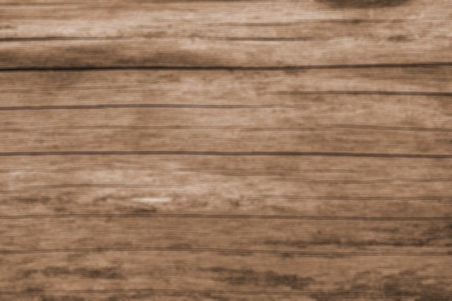
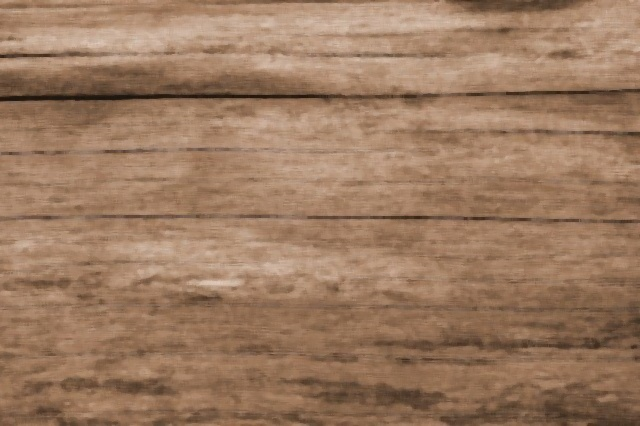

# OpenCV Training Image Blurring/Sharpening.

An introduction to image blurring/sharpening using OpenCV.

## Contents :
I have used 2D-convolution kernels and the OpenCV Computer Vision library to apply different blurring and sharpening techniques to an image. 
These are the functions that I have used:

| Function        |Action                                                                        |
|----------------:|------------------------------------------------------------------------------|
|cv2.filter2D()   |We apply the filter, that accepts 3 arguments:|
|**src**          | Source image|
|**ddepth**       | The second argument is ddepth, which indicates the depth of the resulting image|
|**kernel**       |The identity kernel is a square matrix, where the middle element is 1, and all other elements are zero.|
|cv2.blur()       |We use the built-in blur function to  apply a 5x5 kernel.                        |
|**src**          |Spurce image|
|**ksize**        |Kernel size|

## Test Image used: 
I have used test.jpg & identity.jpg that can be found in the repository.







## Summary:

```python
#Read image
image = cv2.imread('test.jpg')
```
```python
#Define kernel for blurring
kernel1 = np.array([[0, 0, 0],
                   [0, 1, 0],
                   [0, 0, 0]])
```

```python
#Define kernel for sharpening
kernel3 = np.array([[0, -1, 0],
                   [-1, 5, -1],
                   [0, -1, 0]])
```
```python
#Define arguments for filter2D()
identity = cv2.filter2D(src=image, ddepth=-1, kernel=kernel1)
```

```python
identity = cv2.blur(src=image, ksize=(5,5))
```

```python
#Define 5x5 kernel and normalize it by dividing by the num. elements in kernel
kernel2 = np.ones((5, 5), np.float32) / 25
```

```python
gaussian_blur = cv2.GaussianBlur(src=image, ksize=(5,5), sigmaX=0,sigmaY=0)
```

```python
median_blur = cv2.medianBlur(src=image, ksize=5)
```

